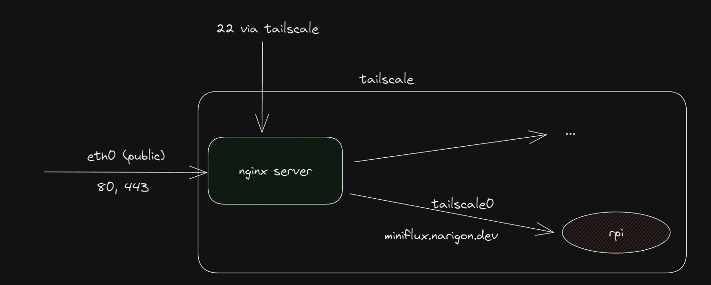

import { T } from "../../../src/components/Markdown"

Hey there once again dear reader. In this blog post we'll go about how you could set up Tailscale in a way that it exposes HTTP services from your internal network.


<Caption>If we do well, this is what we should end up with.</Caption>

### What the hell is Tailscale and why should I use it?
Tailscale is a [mesh VPN](https://en.wikipedia.org/wiki/Mesh_networking) built on top of [Wireguard.](https://www.wireguard.com/)
Because it's a mesh VPN instead of a traditional one, there's no single point of failure between the nodes. It also does some other niceties for you, such as performs [NAT traversal](https://tailscale.com/blog/how-nat-traversal-works/) for you.  

### How the hell do I use it?
> I think it's worth saying here that I'm just a happy customer of Tailscale and I'm not being paid by anyone to post this.

As of the writing of this post, on 29-5-2023, Tailscale has a free tier that allows up to 100 devices.  
Adding devices to Tailscale is really simple and you can manage them via their Web UI.  

### Setting it up
import { RiChat1Fill } from "react-icons/ri"

<Callout icon={<RiChat1Fill />} title="Notice">
  <Text color="text.300" fontSize="md">
I'm assuming that by this point you have already connected your Raspberry Pi to your local network and have SSH access to it. You might want to do this before you continue with the post.
  </Text>
</Callout>

Next up you'll want to [install Tailscale](https://tailscale.com/kb/1031/install-linux/) for Raspberry Pi. After installation it should prompt you to attach it to some Tailnet.

After you're done, let's check that your Pi has an IP on the `tailscale0` interface:
```
pi@raspberry:~ $ tailscale ip -4
100.65.12.12
```
You'll need this IP in a bit.

Let's start a simple HTTP server. I'm using a simple HTTP server but you could use something more complicated.
```bash
python3 -m http.server 80
```
<Caption>Let's just use 80 for now - it's a good example and your firewall propably default allows it.</Caption>